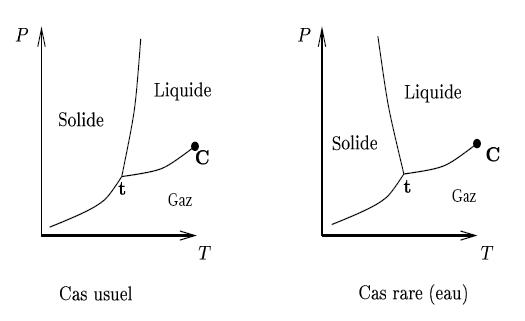

# Diagramme (P,T)

## Dans le programme
- Analyser un diagramme de phases expérimentales (P,T)
- Positionner les phases dans un diagramme (P,T)
- Connaître le nom des transitions de phase

## Au concours
La lecture d'un diagramme (P,T) est régulièrement évaluée à CCINP

- CCINP 2022, Q14 à Q17
- CCINP 2020, Q32 à Q33
- CCINP 2019, Q44 à 45

## Ce qu'il faut savoir

!!! info "Définition"
    Un corps pur peut se trouver sous trois phases, qui dépendent de la température et de la pression. Le diagramme (P,T) d'un corps pur à l'allure **simplifiée** suivante:

    === "Augmentation de l'enthalpie"
        Les changements d'états qui **augmentent** l'enthalpie (fonction de la température) sont les suivants:

        - **Vaporisation**: Liquide -> gaz
        - **Fusion**: Solide -> Liquide
        - **Sublimation**: Solide -> Gaz

    === "Diminution de l'enthalpie"
        Les changements d'états qui **diminuent** l'enthalpie (fonction de la température) sont:

        - **Liquéfaction**: Gaz -> Liquide
        - **Solidification**: Liquide -> Solide
        - **Condensation**: Gaz -> Solide

    <figure markdown>
      { width="600" }
      <figcaption>Diagramme (P,T) dans le cas usuel et dans le cas de l'eau</figcaption>
    </figure>

??? info "Diagramme (P,T) complet de l'eau"
    

## Ce qu'il faut savoir faire

=== "Exercice"

    La figure ci-dessous montre le diagramme (P,T) du dioxyde de carbone

    1. Placer les phases sur le diagramme.
    2. On se place dans les conditions initiales suivante: $T$= 250 K et $P$= 10 bar. Placer ce point dans le diagramme ($P,T$) et en déduire dans quelle phase se trouve le dioxyde de carbone.
    2. Partant de cet état, on comprime lentement le dioxyde de carbone à température constate, pour terminer à la pression $P_f$ = 50 bar. Placer le point final sur le graphe, en déduire dans quelle phase se trouve le dioxyde de carbone dans l’état final. Décrire alors les différentes étapes de cette compression
    3. Tracer l'allure du graphe représentant la pression du $CO_2$ en fonction du temps.

=== "Aide"

    1. Sed sagittis eleifend rutrum
    2. Donec vitae suscipit est
    3. Nulla tempor lobortis orci

=== "Solution"
